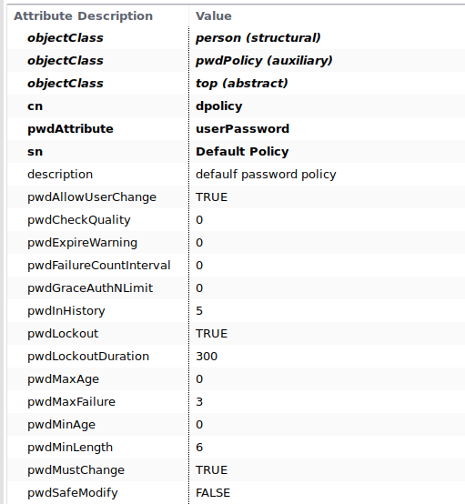

# OpenLDAP'a Parola Politikası Yülemek (ppolicy)
OpenLdap şifre politikaları dinamik olarak yüklenebilen bir modüle sahiptir. userPassword özniteliğine sahip kullanıcılar için politika tanımlamalarına izin verir. 

**Note:**  Bağlantı ve DN parametleri OpenLdap kurulumuna bağlıdır. Bu parametreleri girmeniz istenecektir.

## Manuel Konfigürasyon

Eğer ldap eski versiyonsa konfigürasyon slapd.conf üzerinden diğer durumda olc (online configuration databes) ile yaplır.
### OpenLDAP - OLC
**1.Adım:**  OpenLdap sunucusunda **/etc/ldap/schema/ppolicy.ldif** dizini altında bulunan ppolicy şeması 
<pre><b>ldapmodify -a -x -D "cn=admin,cn=config" -W -f /etc/ldap/schema/ppolicy.ldif</b></pre>

komutu kullanılarak sisteme eklenir.

**2.Adım:** ppolicymodule.ldif dosyası oluşturulur ve ldif içeriği;
<pre><i>dn: cn=module{0},cn=config
changetype: modify
add: olcModuleLoad
olcModuleLoad: ppolicy 
</i></pre>

şeklinde düzenlenir.Ldif oluşturulduğu dizinde,
<pre> <b>ldapmodify -a -x -D "cn=admin,cn=config" -W -f ppolicymodule.ldif</b></pre>

komutu kullanılarak sisteme eklenir.

**3.Adım:** ppolicyoverlay.ldif dosyası oluşturulur. Ldif içeriği ;

<pre><i>dn: olcOverlay={0}ppolicy,olcDatabase={1}hdb,cn=config
objectClass: olcOverlayConfig
objectClass: olcPPolicyConfig
olcOverlay: {0}ppolicy
olcPPolicyDefault: cn=DefaultPolicy,ou=PasswordPolicies,dc=tuncay,dc=colak
olcPPolicyHashCleartext: TRUE
olcPPolicyUseLockout: TRUE
olcPPolicyForwardUpdates: FALSE
</i></pre>

şeklinde düzenlenir.Ldif oluşturulduğu dizinde,
<pre> <b>ldapmodify -a -x -D "cn=admin,cn=config" -W -f ppolicymodule.ldif </b></pre>

komutu kullanılarak sisteme eklenir.
burada olcPPolicyDefault değişkeni kendi ldap ayaralrınıza göre düzenlenir. Burada bahsedilen DefaultPolicy düğümü sonradan ya da önceden oluşturulmuş olabilir. O anda ldap üzerinde bulunması zorunlu değildir. Bu düğümde bulunan ayarlar bütün kullanıcılar için geçerli varsayılan şifre politikası olacaktır.

**4.Adım:** ldif dosyaları sisteme yüklendikten sonra 
<pre><b>systemctl restart slapd.service</b></pre>

komutu kullanılarak slapd servisi yeniden başlatılmalıdır.

#### DefaultPolicy Düğümü Oluşturma

DefaultPolicy düğümü için defaultpolicy.ldif dosyası oluşturulur ve dosya içeriği;
<pre><i>
dn: ou=PasswordPolicies,dc=tuncay,dc=colak
objectClass: organizationalUnit
objectClass: top
ou: PasswordPolicies
description: password policy group

dn: cn=DefaultPolicy,ou=PasswordPolicies,dc=tuncay,dc=colak
objectClass: person
objectClass: pwdPolicy
objectClass: top
cn: DefaultPolicy
pwdAttribute: userPassword
sn: DefaultPolicy
description: default password policy
pwdAllowUserChange: TRUE
pwdCheckQuality: 0
pwdExpireWarning: 0
pwdFailureCountInterval: 0
pwdGraceAuthNLimit: 2
pwdInHistory: 3
pwdLockout: TRUE
pwdLockoutDuration: 300
pwdMaxAge: 30000
pwdMaxFailure: 3
pwdMinAge: 0
pwdMinLength: 4
pwdMustChange: TRUE
pwdSafeModify: FALSE
</i></pre>

şeklinde düzenlenir. Ldif oluşturulduğu dizinde admin kullanıcısı ile

<pre><b>ldapadd -x -W -D "cn=admin,dc=tuncay,dc=colak" -f defaultpolicy.ldif</b></pre>

komutu kullanılarak sisteme eklenir.

**Örnek:** default ppolicy attribute

